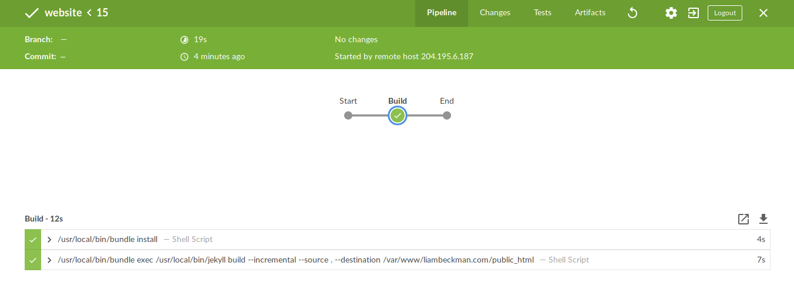

[][jenkins]

# About

A small Jekyll site for showing off personal projects!

# Building

## Requirements

- [Ruby](https://www.ruby-lang.org/en/): for building the site with Jekyll and Bundler.
- [Jekyll](https://jekyllrb.com/): static site generator.
- [Bundler](https://bundler.io/): dependency management.
- [Git](https://www.ruby-lang.org/en/): source code management.

## Instructions

Source code can be found [here](https://github.com/lbeckman314/website). To spin up your own site, follow [the jekyll quick-start quide](https://jekyllrb.com/docs/quickstart/) (adapted below):

```shell
# install ruby
# for OS-specific instructions, check out https://www.ruby-lang.org/en/downloads/

# Install Jekyll and Bundler gems through RubyGems
gem install jekyll bundler

# install dependencies
bundle install

# Create a new Jekyll site at ./myblog
jekyll new myblog

# alternatively, clone an existing jekyll site
# git clone https://liambeckman.com/cgit/website.git

# Change into your new directory
cd myblog

# Build the site on the preview server
bundle exec jekyll serve

# Now browse to http://localhost:4000

# then you can change the html/css files in the myblog directory to suit your tastes!

# hosting is a whole 'nother beast, but services like github pages
# and gitlab pages make free hosting relatively easier.
```

# CI/CD

The website is updated every time a push is made to the `master` branch. Build commands are defined in the [Jenkinsfile](./Jenkinsfile), and build results can be viewed at either of the following URL's.

- [Jenkins (standard)][jenkins]
- [Jenkins (Blue Ocean)][blue]

[][blue]

[jenkins]: https://liambeckman.com/jenkins/job/git.liambeckman.com/job/website/job/master/
[blue]: https://liambeckman.com/jenkins/blue/organizations/jenkins/git.liambeckman.com%2Fwebsite

